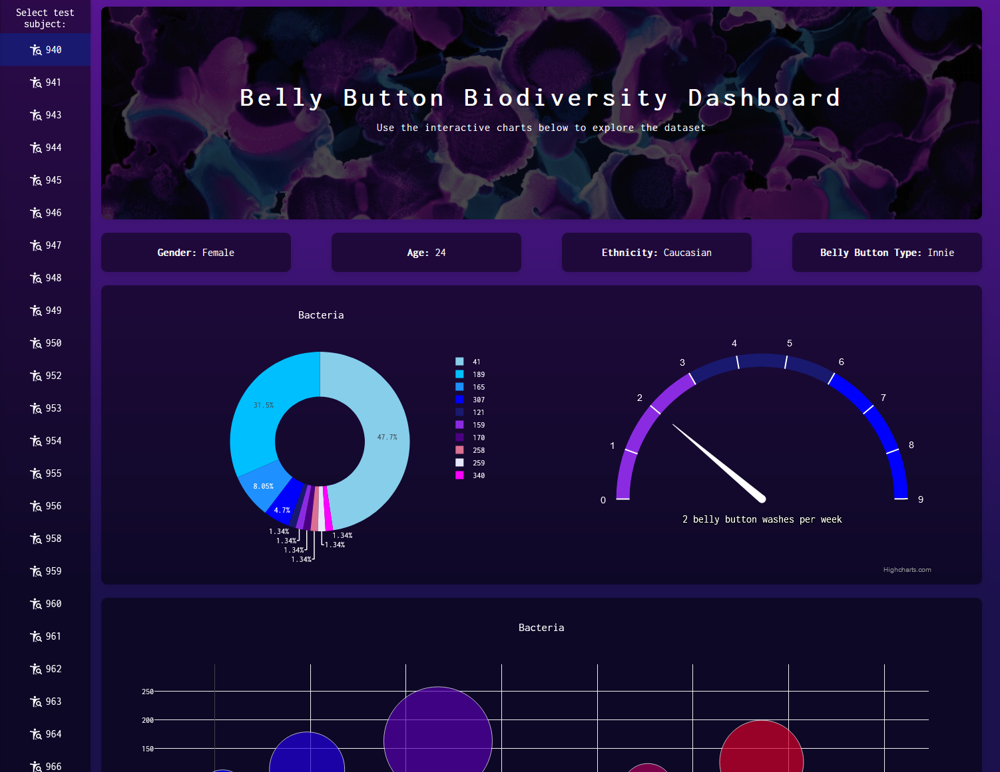

# Belly Button Biodiversity

An interactive data dashboard for exploring the various bacteria present on the human belly button. Plotly.js was used to display an interactive pie chart and bubble chart. Highcharts was used to display a gauge chart. This project was based on Dan Fergus's and Sarah Council's _Belly Button Biodiversity_: http://robdunnlab.com/projects/belly-button-biodiversity/

_This project was for an assignment at Washington University's Data Analytics Boot Camp (2019)_



[Visit the webpage](http://belly-button-biodiversity.us-east-2.elasticbeanstalk.com/)

# Table of contents

[Visit the webpage](http://belly-button-biodiversity.us-east-2.elasticbeanstalk.com/)

- [Technologies Used](#technologies-used)
- [How to run locally](#how-to-run-locally)
  - [Run on Windows](#run-on-windows)
  - [Run on Docker](#run-on-docker)
- [Screenshots](#screenshots)
  - [Desktop](#desktop)
  - [Mobile](#mobile)

# Technologies Used

- Python (3.11)
- JavaScript
- HTML
- CSS
- Flask
- Pandas
- d3.js
- Highcharts
- Plotly.js
- SQLAlchemy
- flask_sqlalchemy
- SQLite
- Docker

# How to run locally

- If you are trying to run this application directly on a Windows OS, you will need to install `Python 3.11`.
- Otherwise, you will need to install Docker so you can run the application through Docker.

## Run on Windows

Assumes you are using a modern Windows client OS such as Windows 11 or Windows 10 and that Python 3.11 is installed.

**It is assumed the user is at the root of this project and is using a UNIX style command line environment when referencing the CLI commands below.**

Open terminal at root of this project then move into application/ directory:

```
cd application/
```

Create venv folder in application folder using Python 3.11:

```
python3.11 -m venv venv
```

Activate venv:

```
source venv/Scripts/activate
```

Install python packages to venv:

```
pip install -r requirements.txt
```

Start application:

```
python application.py
```

## Run on Docker

Firstly, confirm that Docker is installed and running. Next confirm that no other application is using port `5000` as port `5000` is needed for the Flask server. If you need to run Flask on an alternative port, you can modify the last line in the `application/application.py` file and the ports in the `docker/docker-compose.yml` file.

**It is assumed the user is at the root of this project and is using a UNIX style command line environment when referencing the CLI commands below.**

Open terminal at root of this project then move into docker/ directory:

```
cd docker/
```

Build Docker image and start Docker container:

```
docker compose up --build
```

Visit: http://localhost:5000 to use the application.

# Screenshots

## Desktop

### View


### View 2 (scrolled down)


### View 1 (A different test subject selected)


### View 2 (A different test subject selected)


## Mobile

### Top View


### Scrolled down (1)


### Scrolled down (2)


### View Top - Menu Open


### View Top - Meu Open - New subject selected


