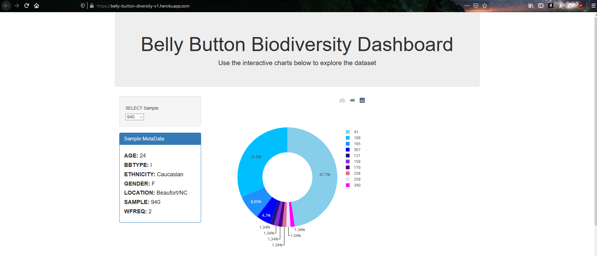
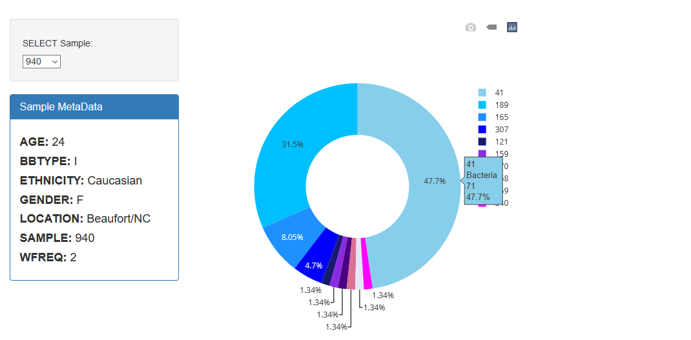
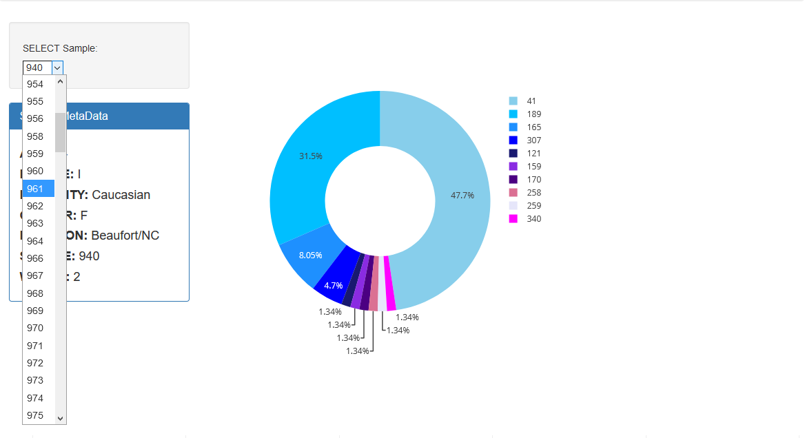
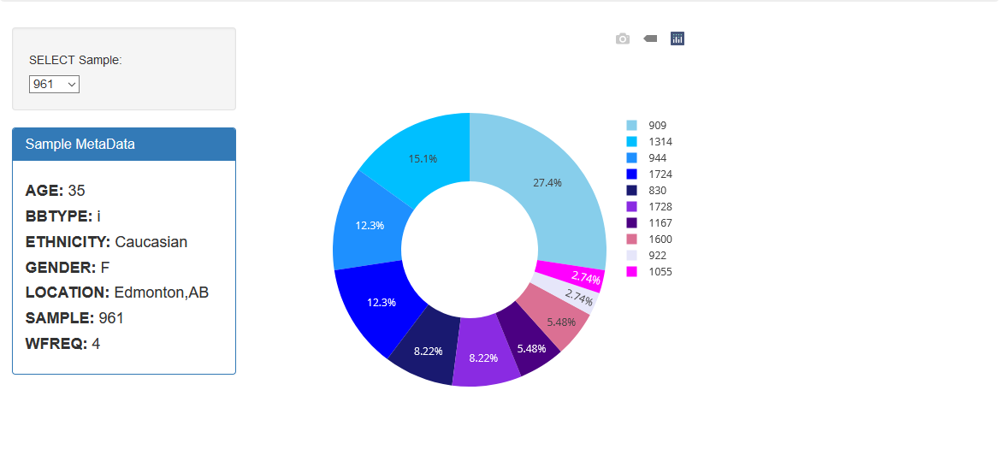
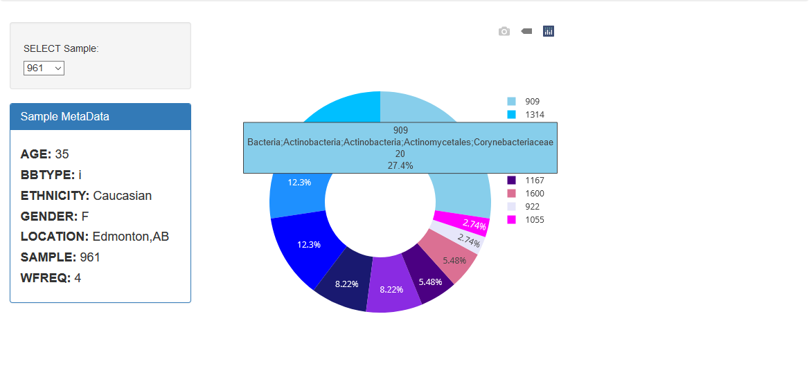
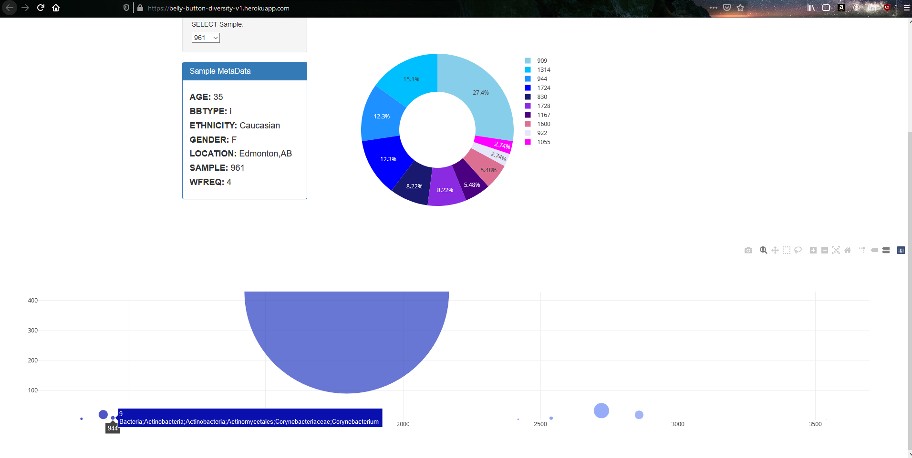
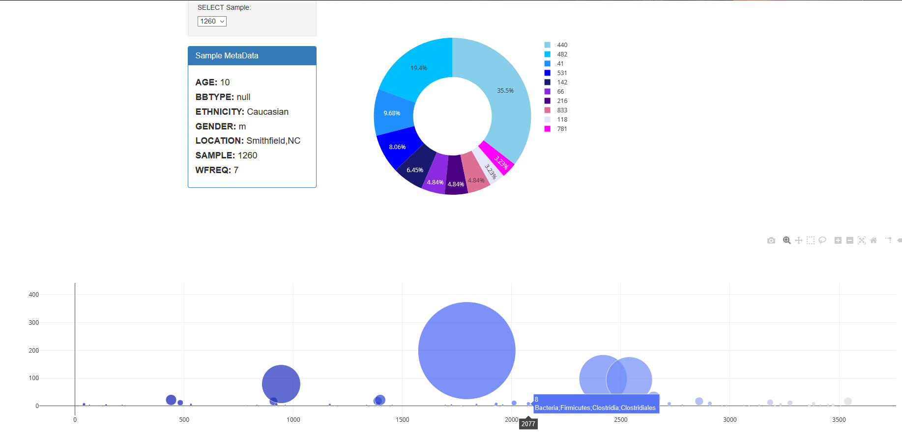

# Belly Button Biodiversity

An interactive data dashboard for exploring the various bacteria present on the human belly button. The app uses Plotly.js to display an interactive pie chart and bubble chart with a dropdown for each sample.
This project was based on Dan Fergus's and Sarah Council's _Belly Button Biodiversity_: http://robdunnlab.com/projects/belly-button-biodiversity/

_This project was for an assignment at Washington University's Data Analytics Boot Camp (2019)_


# Table of contents

- [Technologies Used](#technologies-used)
- [How to run locally](#how-to-run-locally)
  - [Run on Windows](#run-on-windows)
  - [Run on Docker](#run-on-docker)
- [Screenshots](#screenshots)

# Technologies Used

- Python (3.11)
- JavaScript
- HTML
- CSS
- Flask
- Pandas
- d3.js
- Plotly.js
- SQLAlchemy
- flask_sqlalchemy
- SQLite
- Bootstrap 3
- Docker

# How to run locally

- If you are trying to run this application directly on a Windows OS, you will need to install `Python 3.11`.
- Otherwise, you will need to install Docker so you can run the application through Docker.

## Run on Windows

Assumes you are using a modern Windows client OS such as Windows 11 or Windows 10 and that Python 3.11 is installed.

**It is assumed the user is at the root of this project and is using a UNIX style command line environment when referencing the CLI commands below.**

Open terminal at root of this project then move into application/ directory:

```
cd application/
```

Create venv folder in application folder using Python 3.11:

```
python3.11 -m venv venv
```

Activate venv:

```
source venv/Scripts/activate
```

Install python packages to venv:

```
pip install -r requirements.txt
```

Start application:

```
python application.py
```

## Run on Docker

Firstly, confirm that Docker is installed and running. Next confirm that no other application is using port `5000` as port `5000` is needed for the Flask server. If you need to run Flask on an alternative port, you can modify the last line in the `application/application.py` file.

**It is assumed the user is at the root of this project and is using a UNIX style command line environment when referencing the CLI commands below.**

Open terminal at root of this project then move into docker/ directory:

```
cd docker/
```

Build Docker image and start Docker container:

```
docker compose up --build
```

Visit: http://localhost:5000 to use the application.

# Screenshots

## Default view - pie chart



## Default pie Chart



## Sample dropdown



## Results of selecting sample #961



## Pie chart hover text



## Pie chart + bubble chart (sample #961)



## Pie chart + bubble chart (sample #1260)


